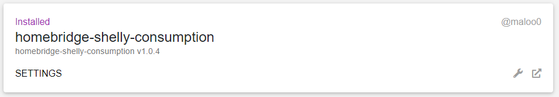

# homebridge-shelly-consumption

## Plugin description
This homebridge plugin provides the possibility to get the consumption values of **Shelly EM** and **Shelly 3EM** in HomeKit. 
Because HomeKit doesn't support any consumption service, here the values are integrated as LightSensor-Service. So the unit of the value 
is Lux.

Actually, this only is a beta version and a very new plugin.
Should any errors occur, of course you can open an issue in GitHub. Suggestions for improvement are welcome too.
Thanks a lot!

## Supported devices
- Shelly EM
- Shelly 3EM

## Installation
For installation of this plugin, follow these instructions:
1. Install the plugin by using the [Homebridge Config UI X](https://github.com/oznu/homebridge-config-ui-x) or by running ```npm install -g homebridge-shelly-consumption```.
2. After installation, the plugin must be configured as described below.

## Configuration
After installation, the plugin appears on the Homebridge UI X under the tab *Plugins* looking like shown below:



For configuration click on *Settings*. The following dialog will pop up:


At beginning, the configruation is empty and you have to set it up like described next.
An example of configuration is shown here too:


1. First you have to enter the user and password of your Shelly devices. You don't need to set these if authentication isn't activated on your Shelly devices.
2. Next you can add devices by using the button *ADD SHELLY DEVICE*. 
   Here you enter the values for the following attributes:
   - Name:  *Optional* Here you can enter a name for the device. This is the label, the accessory is appearing with in HomeKit later. The value can be changed later (In the plugin settings and also in HomeKit).
   - IP-address:  Here you have to enter the IP address of the Shelly device.
   - Device type:  Select the device type of your device. Depending on this, the checkboxes below appear or disappear.
   - emeter channels:  Here you have to select which channels of the device should be used for this accessory. The selected channels will be summed up and the total consumption value will be provided to HomeKit. So, in HomeKit you will see one single brightness sensor accessory. 
     <br />If you want to have the single channel consumption values separately in HomeKit, you can add a further device selecting the appropriate channels. On this way you also can add further accessories which summ up different channels. This makes it very flexible for you.
     <br />Important for this: It only is possible to add devices with the same IP address and the same channel selection one time.
     An example for this is shown below:


Please remind: After saving the configuration once, changes done later maybe won't be taken. In this case, it could be necessary to remove the corresponding device, save the config, restart homebridge, add the device newly, save config and restart homebridge again.

## Appearance in HomeKit
Like described above, the accessory appears as a brightness sensor and the consumption value will be provided as Lux value.
A photo of appearance / settings in Homekit is shown below (here in german):


Important information for everybody who uses the Shelly devices for measurement of negative values too. For example if you have photovoltaics and you feed in electricity into the power grid: The accessory provides a further indicator named *Status: active* (in german: *Status: Aktiv*). This shows if you have a negative or positive consumption value. 
  *Yes* stands for positive value
  *No* stands for negative value

In the future I probably will change this, so that you can recognize this more directly and more obvious. Maybe by adding a further accessory of another accessory type.


## Hints
At least I want to tell that this plugin isn't tested in detail. So it's possible that there will be some problems with it.
If so, don't hesitate to contact me. 

I implemenented this plugin in my free time. If you would like to support me on any ways, feel free to contact me. Further I would be thankful if you want to help me by donating a small amount, so I can buy further devices to add support for those. For this please contact me too.
